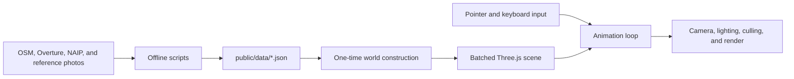

# Sugarland

Sugarland is a small, browser-based walking and driving sim built from a real map of Clewiston, Florida. It uses Three.js and a collection of checked-in geographic datasets to reconstruct the town as a stylized, low-poly world.

The project is intentionally static at runtime: there is no map server, backend, physics engine, or asset loader beyond ordinary JSON fetches. Most of the expensive geographic work happens in the scripts under `scripts/`, and the browser turns their output into a handful of batched meshes.

## Run it

Requirements: a current Node.js release (Node 18 or newer is also required by the data-fetch scripts).

```sh
npm install
npm run dev
```

Open the local URL printed by Vite. The checked-in files under `public/data/` are enough to run the sim; rebuilding the map data is optional.

To make and inspect a production build:

```sh
npm run build
npm run preview
```

There is currently no automated test or lint command. `npm run build` is the basic project-wide verification.

## Controls

| Input | Action |
| --- | --- |
| Click | Capture the pointer and look around |
| `W` `A` `S` `D` or arrow keys | Move forward/back or steer continuously |
| `Shift` | Jog while on foot or engage the cart's turbo speed |
| `E` | Enter/leave a nearby cart; hold while far away to summon it |
| Time slider | Set the time of day |
| **cycle** checkbox | Run a full day/night cycle in four minutes |

## How the project fits together



The main runtime pieces are:

- `src/main.js` loads data, owns the intro state machine, and runs the animation loop.
- `src/world.js` converts map features into buildings, roads, water, vegetation, and collision data.
- `src/player.js` contains both on-foot movement and golf-cart driving.
- `src/daynight.js` moves a player-centered sun and changes sky, fog, and ambient light.
- `src/facades.js` generates the repeating wall textures in memory; there are no facade image assets.
- `src/sidewalks.js`, `src/streetnames.js`, `src/signage.js`, and `src/labels.js` derive street-level detail from the baked map data.
- `src/landmarks.js` adds the Herbert Hoover Dike and the sugar mill skyline.

See [docs/architecture.md](docs/architecture.md) for the coordinate system, data contracts, rendering strategy, collision model, geographic assumptions, and data-refresh workflow.

## Repository layout

| Path | Purpose |
| --- | --- |
| `index.html` | Canvas, HUD, title screen, and all page-level CSS |
| `src/` | Browser runtime and procedural scene construction |
| `public/data/` | Runtime-ready, checked-in JSON served by Vite |
| `scripts/` | Map ingestion and imagery-analysis tools |
| `data-src/` | Raw Overture exports, aerial tiles, and reference imagery used offline |

`data-src/` is source material, not a runtime dependency. In particular, the large NAIP and Mapillary images are not shipped by the Vite build.

## Refreshing the map data

Refreshing data is a maintainer workflow, not a prerequisite for running the game. It rewrites checked-in files, uses network services, and should be reviewed as a data change.

The base refresh is:

```sh
npm run fetch-data
```

That command fetches OpenStreetMap data into `public/data/clewiston.json`, then merges the checked-in Overture building export. It does **not** refresh places, roof colors, trees, or hand-curated building details.

Dependent enrichment steps are run explicitly:

```sh
node scripts/process-places.mjs
python3 scripts/extract-roof-colors.py
python3 scripts/extract-trees.py
```

USGS 3DEP LiDAR supplies measured eave/ridge height and roof morphology. Start with the five-building downtown validation set:

```sh
npm run fetch-lidar-pilot
python3 -m venv .venv-lidar
.venv-lidar/bin/pip install -r scripts/lidar-requirements.txt
npm run test-lidar
npm run extract-lidar
```

Raw `.laz` files are cached locally and ignored by Git. The checked-in manifest and compact `public/data/building-morphology.json` make the result reproducible. See [LiDAR building morphology](docs/lidar-morphology.md) before expanding to the full town; the rectangular raw-tile download is roughly 6.5 GB and crosses three work units.

The roof-color script downloads and caches USDA NAIP tiles when necessary. The tree script reuses that exact tile grid, so roof extraction must establish a compatible cache before tree extraction.

Reference imagery follows a repeatable facade-description path:

```sh
npm run imagery:inventory
npm run imagery:coverage
npm run imagery:plan -- --limit 150
npm run imagery:download-plan
npm run imagery:prepare
npm run imagery:coverage
```

The inventory discovers town-wide Mapillary metadata without downloading images. The coverage-aware planner then chooses a bounded, geographically diverse batch that should expose the most unenhanced buildings. Both network scripts read a Mapillary credential from `MAPILLARY_TOKEN` or `data-src/.mapillary_token`; keep credentials local and out of version control. Preparation discovers every cached imagery source with an `index.json`, scores all plausible visible facade edges, and creates model/human review tasks. While the development server is running, open `/coverage.html` to inspect which areas are available, downloaded, analyzed, or enhanced. Validated results are imported with:

```sh
npm run imagery:import-descriptors -- path/to/results.json
```

For self-collected imagery, Mapillary Tools can extract GPS, timestamp, heading, and projection metadata without uploading the photos. Convert that output into the same index used by downloaded Mapillary frames:

```sh
npm run imagery:import-capture -- data-src/imagery/clewiston-field-2026
npm run imagery:prepare
```

See [the imagery-to-building workflow](docs/imagery-pipeline.md) for capture advice, schemas, review rules, and licensing/provenance notes.

After any Overture merge, regenerate ID-keyed derived data and recheck manually curated negative-ID entries. Numeric Overture-only IDs are still assigned by merge order for runtime compatibility, but every building now also carries a stable `sourceId` (`osm:way/...` or `overture:<uuid>`). Descriptor imports verify that stable identity when it is supplied.
