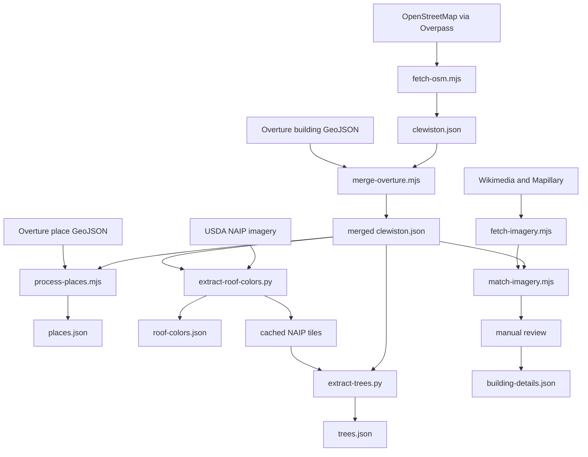

# Architecture and implementation notes

## Mental model

Sugarland is a data-oriented scene reconstruction rather than a conventional game-engine project. The runtime does not retain a rich entity for every building, tree, or road. Instead, it reads a compact local map, turns most of it into merged or instanced geometry once, and keeps only the small amount of mutable state needed for the player, cart, lighting, overlays, and steam animation.

That choice explains most of the implementation:

- geographic fidelity is baked into JSON before the app starts;
- procedural details are deterministic, so reloads look the same;
- collision is a 2D footprint query rather than rigid-body physics;
- distant world detail is inexpensive because buildings and roads use a small number of draw calls;
- changing the source data generally requires a page reload and a full world rebuild.

## Coordinate system

All runtime geometry uses a local, meter-scale coordinate system centered at latitude `26.754`, longitude `-80.9335`.

```text
x = east/west, positive east
y = height, positive up
z = north/south, positive south
```

The unusual south-positive `z` axis comes from the projection used by the ingestion scripts:

```text
x = (longitude - originLongitude) * metersPerDegreeLongitude * cos(originLatitude)
z = -(latitude - originLatitude) * metersPerDegreeLatitude
```

It is a local equirectangular approximation, which is appropriate for the roughly town-sized bounding box. Widths, heights, speeds, culling distances, collision cells, and landmark positions are therefore all expressed in approximate meters. Compass conversion deserves care: geographic north is `-z`, east is `+x`.

The projection constants are repeated in several scripts instead of coming from a shared module. If the origin or projection changes, update every ingestion and imagery tool together.

## Startup and frame lifecycle

`src/main.js` is the composition root.

1. It creates the WebGL renderer, scene, and camera.
2. It loads `clewiston.json`, then the optional appearance and vegetation files.
3. `buildWorld()` constructs static geometry and returns the building collision grid.
4. It creates the player/cart, day/night controller, label renderer, street names, business signs, and landmarks.
5. A title-screen state machine holds the camera in a slow aerial orbit, then performs a 3.8-second smootherstep descent to the player's normal shoulder-camera pose.
6. The animation loop updates the active controller and renders the WebGL scene plus any enabled CSS point-of-interest labels.

Frame delta is capped at `0.05` seconds to prevent large movement or animation jumps after the tab stalls. The renderer caps device pixel ratio at `2`, enables soft shadows, and uses ACES filmic tone mapping.

During the aerial intro, the camera near plane is temporarily changed from `0.1` to `2` meters. This is a targeted way to reduce visible z-fighting among the several nearly coplanar road, sidewalk, paint, water, and ground layers; it is restored when the camera lands.

For console exploration, the app exposes the main live objects as `window.__game`:

```js
const { player, dayNight, scene, camera, renderer } = window.__game;
```

This is a debugging hook, not a stable public API.

## Runtime data contracts and fallbacks

The current checked-in snapshot contains roughly 5,700 building footprints, 1,250 road ways, 500 named places, and 13,500 detected tree crowns.

| File | Runtime role | Failure behavior |
| --- | --- | --- |
| `public/data/clewiston.json` | Required base map: origin, buildings, roads, water, canals, green space, and OSM POIs | Startup fails and the loading screen shows the error |
| `public/data/building-details.json` | Hand-curated appearance overrides keyed by building ID | Empty overrides; procedural appearance remains |
| `public/data/roof-colors.json` | NAIP-derived roof colors keyed by building ID | Type-based deterministic roof colors remain |
| `public/data/trees.json` | NAIP-derived `[x, z, crownRadius]` records | A seeded procedural tree scatter is generated |
| `public/data/places.json` | Combined OSM/Overture places used for wall-mounted signs | No business signs are mounted |
| `public/data/freestanding-signs.json` | Curated pole, pylon, and monument signs with independent positions and provenance | No detached business signs are rendered |

The two POI systems intentionally consume different inputs. The floating CSS label renderer can consume `clewiston.json.pois` (the curated OSM subset), while wall-mounted business signs use the broader `places.json` set. Floating building labels are currently disabled in `main.js` so building identity comes from facade signage, but the renderer remains available for future non-building POIs or a curated overlay.

### Building appearance precedence

For each building, the renderer resolves values in this order:

1. manual values from `building-details.json`;
2. an aerial roof color from `roof-colors.json`;
3. deterministic colors and heights derived from building type and ID.

Only a subset of the manual record is currently rendered:

- `wall`, `roof.type`, `roof.color`, `height`, and `stories` affect geometry or material;
- `trim`, `style`, `features`, `signage`, `confidence`, `sources`, and `note` are research/curation metadata for future work.

This is useful separation: the descriptive record can be richer than today's low-poly renderer without changing the runtime contract.

## World construction and batching

`src/world.js` builds the town in broad material buckets instead of creating a mesh per feature.

### Buildings

Every footprint edge becomes two wall triangles with repeating UVs. Buildings are classified into five facade archetypes: house, commercial, storefront, industrial, and plain. Each archetype has one canvas-generated, near-grayscale texture. A per-building vertex color tints the white parts of that texture, allowing thousands of varied buildings to share five materials.

Walls of the same archetype are accumulated into one `BufferGeometry`. Roof caps and optional gables are merged into another vertex-colored mesh, and simple doors share another geometry. This greatly reduces draw calls compared with one mesh and material per building.

Gable roofs do not follow arbitrary roof topology. The code finds the minimum-area oriented rectangle implied by the footprint edges, uses its long axis as the ridge, and places a simple roof prism over the flat roof cap. The default heuristic applies gables to small residential footprints; a manual `roof.type` can force or suppress them.

Door placement is similarly heuristic: a 1.1-meter decal is centered on the longest footprint edge. It is emitted on both sides of that edge because footprint winding is not assumed to be consistent.

### Roads, sidewalks, water, and green space

Roads and canals are triangulated ribbons around source polylines. Large roads get dashed center markings. Sidewalks are derived at runtime by offsetting both sides of qualifying roads; they are not present in the source data and do not form a navigation mesh.

Several flat layers use slightly different `y` values, including small deterministic per-road jitter. Roads also use an explicit surface hierarchy: tracks and service driveways sit below sidewalks; ordinary roads sit above sidewalks; and successively larger road classes sit slightly higher. This acts as inexpensive geometric clipping, making driveways end at pavement edges and preventing sidewalks from crossing through intersections while avoiding coplanar flicker among ground, green, water, asphalt, center lines, and painted names.

Sidewalk generation has a hard-coded town-core boundary (`x -2600..2400`, `z -850..2850`). Features outside it can still render, but they do not receive generated sidewalks.

### Trees

Tree geometry is split into palm, oak, and cypress trunk/crown types and rendered as six `InstancedMesh` objects. The offline dataset supplies crown centers and approximate radii, while the runtime assigns a stylized species using road proximity, canal proximity, and a coordinate hash.

Royal palms along trunk roads are a deliberate second vegetation layer. They are planted procedurally on both verges because thin, bright palm fronds are poorly captured by the aerial RGB canopy detector. Their spacing and variation are deterministic.

If `trees.json` cannot be loaded, the runtime uses a seeded scatter. The seed is `1928`, the year Clewiston incorporated.

## Movement and collision

There is no physics engine. Buildings are inserted into a uniform 24-meter spatial hash, and `Player.blockedAt()` performs a point-in-polygon test only against candidates in the current cell.

Walking and driving share character-relative controls: forward/back moves along the current heading, while left/right combines forward motion with continuous rotation. Movement input recenters the chase camera behind that heading; mouse movement can orbit the camera while the controls are idle. Camera position uses exponential easing, with an additional distance-sensitive catch-up multiplier above the cart's normal top speed so turbo cannot outrun the framing.

On foot, movement probes slightly ahead of the character. When a move is blocked, it separately tries the `x` and `z` portions, producing inexpensive wall sliding. The character animation is four limb pivots driven by a sine wave. Jogging increases forward speed without changing turn speed, so its turning circle is wider.

The golf cart uses a scalar speed, heading, acceleration toward a target speed, and a slower fixed turn rate. Holding Shift raises its forward target speed without changing the turn rate, creating a wider turbo turning circle. While driving, the existing character mesh is parented to the cart and given a scaled seated pose; exiting restores its standing pose and scene-level transform. The cart probes its center plus a point 1.4 meters toward the moving end. A collision simply sets speed to zero.

`E` enters or exits the cart when it is nearby. Holding `E` while it is far away starts an animated summon: the cart appears beyond the rear edge of the camera, follows an eased quadratic curve into view, and stops beside or ahead of the walker. Candidate endpoints and sampled points along the approach reject positions whose center or footprint corners overlap a building. If every animated route is blocked, the cart falls back to an immediate safe placement.

Consequences of this intentionally simple model:

- only building footprints block movement;
- roads, canals, water, trees, the dike, and landmark meshes have no collision;
- collision does not account for height, doors, overhangs, or the full cart width;
- the camera itself has no obstacle avoidance and can pass through geometry near walls.

Spawn selection scans non-service road vertices for the unblocked point closest to the map origin and faces along that road. If no such point exists, it spirals outward from the origin. The parked cart tries a short list of lateral offsets from the chosen spawn.

`player.pos` is also the simulation's point of interest. While driving it is copied from the cart, so label visibility, sign visibility, and the sun/shadow target automatically follow whichever mode the player is using.

## Lighting, atmosphere, and local detail

The 24-hour system interpolates a short set of sky, directional-light, and hemisphere-light keyframes. The sun follows an east-to-west arc and changes from warm near the horizon to pale at altitude. At night, a weak fixed moon light replaces it.

The sun and its shadow target are repositioned around the player each frame. Its orthographic shadow camera covers only the nearby area, keeping useful shadow resolution without attempting to shadow the full multi-kilometer map.

Fog begins at 300 meters and ends at 2,600 meters. The far distance was chosen so the sugar mill, roughly two kilometers south of downtown, remains part of the skyline.

Text uses three strategies:

- POI labels are HTML elements rendered through Three.js's `CSS2DRenderer`;
- street blades, painted road names, and business signs are cached canvas textures on WebGL geometry;
- visibility checks run only every 0.4–0.5 seconds and use squared planar distance.

Business identity structures have two distinct paths. Wall-mounted signs are projected onto a matched building edge, while entries with `type: "freestanding-sign"` are independent scene structures loaded from `freestanding-signs.json`. A freestanding sign can use pole, pylon, or monument supports; stack multiple double-sided panels; set its own orientation and visibility distance; and retain evidence and confidence metadata without pretending to be part of a building facade.

This avoids rebuilding text or doing distance work for every label on every frame.

Street-blade poles are anchored from shared named-road vertices. Their curb offset is derived from each intersecting road's width: a radial search chooses the nearest point with perpendicular clearance beyond every pavement edge plus a small setback, which also handles angled and three-way intersections.

## Landmarks: data-derived and authored

The landmark layer is hybrid.

- The Herbert Hoover Dike is data-derived: every road named exactly `Herbert Hoover Dike` is swept into a nine-meter grass berm with a crest path.
- The sugar mill is authored: stacks, silos, conveyor, and steam use fixed local coordinates around the real industrial cluster. Six reused sprites create the looping plume.
- The downtown communications tower is authored from two Sugarland Highway Mapillary views as a tapered lattice, antenna-panel cluster, dishes, mast, and blinking red obstruction lights.
- The downtown civic cluster is hybrid: researched building descriptors style the library, Youth Center, pool bathhouse, First Bank, and St. Margaret sanctuary footprints, while Civic Park's gazebo and cadet memorial, the pool/splash-pad surfaces, and St. Margaret's tower are authored geometry.
- The Clewiston Inn keeps its Overture U-shaped wall footprint, but landmark geometry supplies the features the generic building extruder cannot express: three green hipped roof masses, a full-height gabled portico with four square columns, its pediment oculus and fanlit entrance, and the five-bay west-facade window rhythm.
- The Hampton Inn keeps its long OSM footprint but overrides the incorrect one-story source height with its documented four-story profile. Landmark geometry adds the raised parapet, warm facade panels, regular hotel-window grid, orange script sign, and deep square-column entrance canopy visible from Sugarland Highway.
- A downtown landmark pass adds geometry that facade descriptors alone cannot express: the three-story U.S. Sugar headquarters and its green roofs, monumental portico, and monument sign; the Harry T. Vaughn Library's stepped civic facade; the reused Dixie Crystal Theatre's turquoise Moderne towers; First Baptist's square tower and spire; Evangel's broad roof, clerestory, and small spire; and City Hall's breeze-block screen, entrance porch, and flags.

The exact road-name match and authored landmark coordinates are hidden geographic dependencies. Renaming source roads, moving the projection origin, or changing the map area requires revisiting `src/landmarks.js`.

## Offline data pipeline



### OSM and Overture division of labor

OSM supplies well-tagged roads, named features, water, green space, POIs, and its building footprints. Overture fills building coverage gaps with non-OSM footprints, principally Microsoft ML Buildings. OSM buildings keep their positive way IDs; merged Overture-only buildings receive negative synthetic IDs. Every building also carries a stable namespaced `sourceId`: `osm:way/<id>` or `overture:<uuid>`.

The merge is idempotent for a fixed Overture export: it drops previously merged negative-ID buildings before adding them again. Numeric IDs are assigned by accepted-feature order, however, so replacing or reordering the export can shift them. The stable `sourceId` lets importers detect or repair that drift. Roof colors and the runtime appearance object are still keyed by numeric ID, so rerun derived extraction and revalidate curated negative-ID buildings after changing the source export.

### Aerial enrichment

The roof script samples interior footprint pixels from public-domain NAIP imagery, takes a per-channel median, then clamps lightness and boosts saturation for the game's palette. It caches 1-kilometer, 0.5-meter-per-pixel tiles in `data-src/naip/`.

The tree script reads those cached tiles rather than downloading its own. It classifies dark excess-green pixels on a 1.5-meter grid, finds connected components, converts small components to a crown, and seeds multiple crowns across large canopy components. Building interiors are removed through a separate spatial index. If detection exceeds 25,000 trees, the script tightens its thresholds and retries.

The scripts share tile conventions through duplicated constants. `extract-trees.py` also contains fixed grid bounds taken from the roof-color run. A change to the map extent, tile size, pixel density, origin, or roof grid must be mirrored in the tree script, or cached tile indices will no longer describe the same geography.

### LiDAR building morphology

USGS 3DEP classified point clouds provide a measurement layer between reviewed imagery and Overture/procedural fallback. `fetch-lidar.mjs` records exact National Map products in `data-src/lidar/manifest.json`; raw LAZ files remain an ignored local cache. `extract-building-morphology.py` streams the point cloud, fits local class-2 ground planes, analyzes class-6 building returns, and writes a full quality/provenance artifact plus a compact runtime artifact.

The renderer applies morphology field by field. Explicit imagery height and roof descriptors win, followed by sufficiently confident LiDAR eave height and roof shape, followed by Overture/OSM attributes and procedural defaults. An imagery story count does not erase a measured parapet/eave height. See [LiDAR building morphology](lidar-morphology.md) for source boundaries, units, confidence, and scaling decisions.

### Street-level reference imagery

Reference images are an offline curation/model input and are not loaded by the game. `match-imagery.mjs` discovers any imagery directory with an `index.json`, evaluates the camera field of view, facade orientation, distance, projected horizontal image region, and simple footprint occlusion, and keeps several plausible facade targets per frame. The rich output is `observations.json`; `matches.json` is a smaller compatibility view.

`build-descriptor-tasks.mjs` turns the observations into model-neutral tasks with a strict output schema. `import-descriptors.mjs` validates identity, colors, stories, facade edge numbers, and door positions before merging accepted output into `building-details.json`. The renderer consumes building-level materials, colors, height/stories, roof type, and signage, plus facade-level window counts, doors, and lighting fixtures. See [Imagery to building model](imagery-pipeline.md) for the operational workflow.

## Performance profile and extension trade-offs

The current renderer favors low draw-call count and simple CPU work over fine-grained streaming:

- static world geometry is merged by material;
- trees use instancing;
- generated text textures are cached by label;
- label and sign culling is throttled;
- collision and nearby-building lookup use uniform spatial hashes;
- the entire town is still constructed eagerly and remains in one scene.

This is a good fit for the present bounded map. If the world grows substantially, the next architectural pressure points will be spatial chunks, frustum/distance culling for world geometry, disposal/rebuild lifecycle, camera collision, and moving projection/config constants into one shared source of truth.
