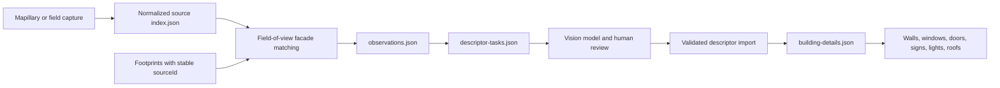

# Imagery to building model

This workflow converts geolocated street imagery into reviewable, provenance-carrying building descriptors and then into visible game details. Current Mapillary frames and future Clewiston field captures use the same normalized index after ingestion.

## What works now

The original downtown download contains 200 Mapillary frames and yields plausible observations for 14 buildings, rather than the six produced by the old one-building-per-center-ray matcher. Those numbers describe the local validation cache, not all imagery available in Clewiston. One image may support several buildings and several footprint edges. Each observation records the target edge, distance, orientation, a rough horizontal image region, occlusion visibility, score, creator, and license.

The pipeline does not silently claim that an inferred value is observed. The model task schema permits `null`, `unknown`, and low confidence, and the importer rejects invalid building identities and facade edges. Model output remains a draft until it is imported.

## End-to-end flow



Run the current local imagery through the deterministic stages:

```sh
npm run imagery:prepare
```

### Inventory and coverage ledger

Discover the full-town Mapillary catalog without downloading thumbnails, then rebuild the coverage ledger:

```sh
npm run imagery:inventory
npm run imagery:coverage
```

`imagery:inventory` spatially tiles the complete game-source bounding box, subdivides saturated cells, follows pagination when the API supplies it, and writes `mapillary/availability.json`. The bbox catalog is treated as a lower-bound discovery index: valid historical cached IDs may be absent from bbox results, so `imagery:coverage` unions the catalog with the local cache instead of allowing a refresh to erase prior evidence. It keeps four states separate:

1. `available`: camera metadata suggests that a frame may see the building;
2. `downloaded`: a candidate frame exists in the local image cache;
3. `analyzed`: the deterministic facade matcher has considered the downloaded frame;
4. `enhanced`: a reviewed Mapillary-backed descriptor is active in the game.

The compact ledger is `data-src/imagery/coverage.json`. `coverage.geojson` contains 50-meter coverage cells and candidate building points for inspection in QGIS or geojson.io. While the development server is running, `/coverage.html` provides an interactive local view with state filters, pan/zoom, and provenance counts. “Available” is intentionally a planning estimate based on distance and camera heading; it does not claim the facade is unobscured or descriptively useful.

Visual review holds and rejections live in `review-decisions.json`. A held target remains visible on the coverage map with its reason, but is excluded from subsequent automatic download plans until new evidence or a human location check resolves it. This prevents repeated batches from spending quota on a known ambiguous footprint.

Plan and download a bounded expansion batch instead of mirroring the entire catalog:

```sh
npm run imagery:plan -- --limit 150
npm run imagery:download-plan
npm run imagery:prepare
npm run imagery:coverage
```

The planner uses deterministic greedy set cover. Each unenhanced building asks for two views; distance and camera centering determine candidate quality, while sequence and 100-meter-cell penalties spread the batch across town. `download-plan.json` records why every frame was selected and which buildings it may support. The downloader retrieves only those thumbnails, merges them into the source index by stable Mapillary image ID, writes images atomically, and is safe to rerun after an interruption. Completed plans are copied into `download-history/` with completion counts before a later planning run replaces the active plan.

Rank the matched review backlog after each import or coverage expansion:

```sh
npm run imagery:review-queue
```

`review-queue.json` excludes buildings with accepted descriptors or explicit review decisions. Its score combines match geometry, target image size, view count, and parcel uniqueness, then separates residential, civic/religious, and commercial/industrial/mixed candidates. This is work-order priority only: it never upgrades evidence confidence and every target still requires visual identity and occlusion checks.

Before preparation, refresh the optional Florida parcel/improvement context when network access is available:

```sh
npm run fetch-parcel-context
```

This deliberately requests no owner fields. It associates building centroids with parcel polygons and makes actual/effective year built, construction class, improvement quality, living area, use code, and building count available to descriptor tasks. These remain parcel-level hints: they describe a predominant improvement and can be wrong for an individual footprint on a multi-building parcel.

This writes:

- `data-src/imagery/observations.json`: complete scored facade observations;
- `data-src/imagery/matches.json`: smaller compatibility view, with the best 20 frames per building;
- `data-src/imagery/descriptor-tasks.json`: target-specific image/model tasks and output schema.

Give each task's prompt, current model, and evidence images to a vision-capable model or reviewer. The `imageRegion` is a normalized left/right interval that points to the target facade. A 360-degree region crossing the panorama seam has `wraps: true` and `left > right`. The region is intentionally approximate: downloaded Mapillary frames do not currently expose reliable camera intrinsics, so ordinary images default to a 90-degree horizontal field of view.

Collect model results as one JSON descriptor, an array of descriptors, or an object keyed by building ID. Then validate and import them:

```sh
npm run imagery:import-descriptors -- path/to/results.json
npm run build
```

The importer accepts either `buildingId` or `buildingSourceId`. Supplying both is preferable: a changed Overture export can renumber a synthetic numeric ID, while `overture:<uuid>` remains an external identity check.

## Adding a field capture

Create one source directory per capture session, keeping the raw images and their metadata together:

```text
data-src/imagery/
  clewiston-field-2026-09/
    IMG_0001.jpg
    IMG_0002.jpg
    mapillary_image_description.json
```

[Mapillary Tools](https://github.com/mapillary/mapillary_tools) can extract metadata locally; the `process` command does not upload imagery. Its documented minimum for still images is GPS longitude, GPS latitude, and capture time. This project additionally needs a camera heading to match a facade.

```sh
mapillary_tools process data-src/imagery/clewiston-field-2026-09 \
  --desc_path data-src/imagery/clewiston-field-2026-09/mapillary_image_description.json

npm run imagery:import-capture -- data-src/imagery/clewiston-field-2026-09
npm run imagery:prepare
```

The importer converts Mapillary's `MAPLatitude`, `MAPLongitude`, `MAPCompassHeading`, capture time, camera, sequence, and projection fields into the common index. Images with processing errors, no heading, or a path outside the source directory are skipped and counted. Flat images default to a 90-degree field of view; replace `horizontalFov` in the generated index if the camera's actual value is known. Equirectangular captures use 360 degrees.

### Capture for facade description, not just navigation

For each block, favor coverage that makes descriptors countable:

- Capture both sides of the street in separate passes. A forward dashcam view makes side facades tiny and oblique.
- Keep the camera level, stable, and consistently mounted; record the mount's heading offset if it does not point straight ahead.
- Aim for overlapping oblique views plus at least one near-perpendicular view of each facade.
- Slow down or stop safely for storefront wording, doors, fixtures, and upper-floor windows.
- Repeat important commercial blocks in even daylight. Dusk is useful as a second pass for lighting, but poor as the only evidence for color and material.
- A 360 camera gives the most forgiving geometry. High-resolution ordinary stills are better for small text; using both is ideal.
- Avoid close-ups of people and capture only from unrestricted public areas. If imagery is uploaded to Mapillary, its service automatically blurs faces and license plates; the raw local originals do not receive that protection.

## Descriptor contract

Building-level fields describe properties shared across the footprint:

| Field | Runtime effect |
|---|---|
| `stories`, `height` | Wall height and vertical texture repetition |
| `wall`, `wallMaterial`, `trim` | Wall tint, facade family, doors, and descriptor signage palette |
| `roof.type`, `roof.color`, `roof.material` | Gable/flat decision and roof color; material remains provenance for future geometry |
| `style`, `features`, `notes` | Research/review context; not all features have geometry yet |
| `signage` | Exact wording mounted on an explicit edge or the longest wall |

Each `facades[]` entry is tied to a zero-based footprint `edgeIndex` and may contain:

- per-floor window counts and pattern notes;
- doors with a normalized `position` along the edge, type, and color;
- lighting fixtures with normalized position, type, and optional height;
- edge-specific wall color/material and freeform observable notes.

The current renderer uses window counts to control horizontal module repetition, adds measured door decals, and adds emissive facade fixtures. Exact text signs are mounted from descriptor signage even when no named OSM place exists. Complex geometry such as arches, columns, awnings, balconies, and parapet profiles is retained in `features`/notes but still needs dedicated procedural components or landmark models.

## Confidence and review rules

- A count is `high` only when the entire target facade is visible without significant vegetation, vehicles, glare, or crop.
- Use multiple dates/views to distinguish permanent architecture from temporary banners, parked objects, and tenant paint.
- Store exact signage separately from the inferred business identity. A faded or partial word should remain partial and low confidence.
- Do not infer the hidden back facade from the front facade.
- Color names are not enough for rendering. Use a six-digit sRGB hex estimate and keep uncertainty in notes.
- Every accepted descriptor should retain `evidence` entries naming the source image and supported fields.

## Provenance and licensing

Mapillary says its images are shared under CC BY-SA and provides an attribution format. It also states that derived metadata published outside OpenStreetMap should be publicly accessible and licensed under ODbL. Keep source, creator, image ID/file, and license on observations and accepted evidence; decide the project's distribution and attribution policy before shipping Mapillary-derived descriptors.

Self-collected imagery gives the project a cleaner provenance path because the photographer retains the originals. The generated index marks these frames as project-owned but deliberately asks for a release-policy decision before redistribution. If the same photos are uploaded to Mapillary, keep the local-original and Mapillary evidence identities distinct.

Relevant source guidance:

- [Mapillary Tools and image-description format](https://github.com/mapillary/mapillary_tools)
- [Mapillary imagery CC BY-SA guidance](https://help.mapillary.com/hc/en-us/articles/115001770409-CC-BY-SA-license-for-open-data)
- [Mapillary derived-metadata guidance](https://help.mapillary.com/hc/en-us/articles/115001777705-OpenStreetMap-compatibility)
- [Mapillary privacy guidance](https://help.mapillary.com/hc/en-us/articles/115001770349-Privacy)
- [Florida statewide cadastral service](https://services9.arcgis.com/Gh9awoU677aKree0/arcgis/rest/services/Florida_Statewide_Cadastral/FeatureServer/0)
- [Florida DOR field definitions and construction-class codes](https://floridarevenue.com/property/dataportal/Documents/PTO%20Data%20Portal/User%20Guides/2024%20Users%20guide%20and%20quick%20reference/2024_NAL_SDF_NAP_Users_Guide.pdf)
