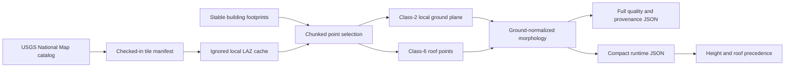

# LiDAR building morphology

The LiDAR layer measures town-wide building massing where street imagery is unavailable. It produces ground-relative eave/ridge height, a conservative story estimate, and a roof-family hypothesis with field-specific confidence.

## Source and units

The selected source is the USGS 3DEP `FL_Peninsular_FDEM_2018_D19_DRRA` project, acquired during 2018–2019. The game extent crosses three work units:

- `FL_Peninsular_FDEM_Glades_2018`;
- `FL_Peninsular_FDEM_Hendry_2018`;
- `FL_Peninsular_FDEM_PalmBeach_2019`.

The current five-building pilot needs one 203.6 MB Hendry tile. A rectangular raw-LAZ query for the full game returns approximately 34 tiles and 6.5 GB, so the production expansion should use footprint-buffered EPT cells rather than cache the entire rectangle.

USGS describes this project as Quality Level 1. The Hendry report records roughly eight first returns per square meter, 0.35-meter nominal point spacing, class 2 ground, and class 6 buildings.

The raw LAZ header is an explicit compound CRS:

```text
Horizontal: EPSG:6438 NAD83(2011) / Florida East (US survey feet)
Vertical:   EPSG:6360 NAVD88 Geoid12B height (US survey feet)
Scale:      0.3048006096012192 meters per source unit
```

The extractor refuses a missing/unknown compound CRS or an unexpected vertical scale. This is intentional: a feet/meters mistake would create plausible-looking but catastrophically incorrect buildings.

Official references:

- [USGS 3DEP public point-cloud dataset](https://www.usgs.gov/news/technical-announcement/usgs-3dep-lidar-point-cloud-now-available-amazon-public-dataset)
- [USGS Hendry acquisition and quality report](https://rockyweb.usgs.gov/vdelivery/Datasets/Staged/Elevation/metadata/FL_Peninsular_FDEM_2018_D19_DRRA/FL_Peninsular_FDEM_Hendry_2018/reports/Hendry_County_Report_USGS.pdf)
- [USGS National Map Access API](https://tnmaccess.nationalmap.gov/api/v1/docs)
- [PDAL EPT reader](https://pdal.io/en/stable/stages/readers.ept.html)

## Data flow



Run the deterministic pilot:

```sh
npm run fetch-lidar-pilot
python3 -m venv .venv-lidar
.venv-lidar/bin/pip install -r scripts/lidar-requirements.txt
npm run test-lidar
npm run extract-lidar
```

`fetch-lidar.mjs --pilot` derives its bounding box from the top five imagery tasks. Without `--pilot`, it queries the whole game. Downloads above 2 GB require the explicit `--allow-large-download` flag.

## Extraction model

For each footprint, the script:

1. Streams LAZ in two-million-point chunks and retains only points near selected buildings.
2. Uses class-2 returns in a 1–9 meter exterior ring to robustly fit local ground.
3. Uses class-6 points inside the footprint; class 1 is an explicitly flagged fallback.
4. Converts horizontal and vertical coordinates to meters before any plane fitting.
5. Rejects implausible ground-relative roof heights.
6. Fits a robust single plane and searches for two opposing planes.
7. Classifies `flat`, `shed`, `gable`, `complex`, or insufficient evidence.
8. Writes per-field confidence, density, coverage, residual, classification fraction, flags, and source tiles.

The initial roof model intentionally favors conservative massing. Hip roofs, parapets, HVAC equipment, awnings, attached garages, vegetation, and footprint/source-date mismatch remain explicit failure modes.

## Runtime precedence

Precedence is field-specific:

```text
reviewed imagery measurement
        ↓
LiDAR morphology with score >= 0.55
        ↓
explicit OSM/Overture attribute
        ↓
procedural fallback
```

For example, imagery can assert that the tall-parapet teal building is one occupied story while LiDAR supplies its 7.48-meter exterior height. The renderer should use both rather than converting one story back into an arbitrary 3.4-meter wall.

LiDAR-only story estimates never exceed medium confidence. Churches, warehouses, hangars, and industrial buildings are protected from tall-clear-span-to-multistory mistakes.

## Pilot results

The initial downtown tile produced usable morphology for all five selected buildings:

| Building | Eave | Ridge | Roof result | Height confidence |
|---|---:|---:|---|---|
| Clewiston Museum candidate (`554185195`) | 3.58 m | 4.83 m | complex; shape insufficient | high |
| Teal parapet building (`886227325`) | 7.48 m | 7.48 m | flat | high |
| Mattress Depot block (`886227326`) | 4.04 m | 4.96 m | complex; shape low | high |
| Badcock (`886227327`) | 4.10 m | 4.10 m | flat | high |
| Dealership office (`-1002452`) | 4.07 m | 4.07 m | flat | high |

Height can remain high when roof-family confidence is low. The renderer consumes each field independently.

## Scaling beyond the pilot

The raw-LAZ path is simple and reproducible for validation. For town-wide processing, move ingestion to the public EPT roots and process buffered 250–500 meter cells containing buildings. Retain the same numerical morphology core and output schema.

Useful EPT roots:

```text
https://usgs-lidar-public.s3.amazonaws.com/FL_Peninsular_FDEM_Glades_2018/ept.json
https://usgs-lidar-public.s3.amazonaws.com/FL_Peninsular_FDEM_Hendry_2018/ept.json
https://usgs-lidar-public.s3.amazonaws.com/FL_Peninsular_FDEM_PalmBeach_2019/ept.json
```

This numerical stage should be parallelized by spatial cell, not delegated to language models. Smaller vision models are appropriate for ambiguous facade descriptions; deterministic point-cloud fitting is cheaper, testable, and more reliable for geometry.
